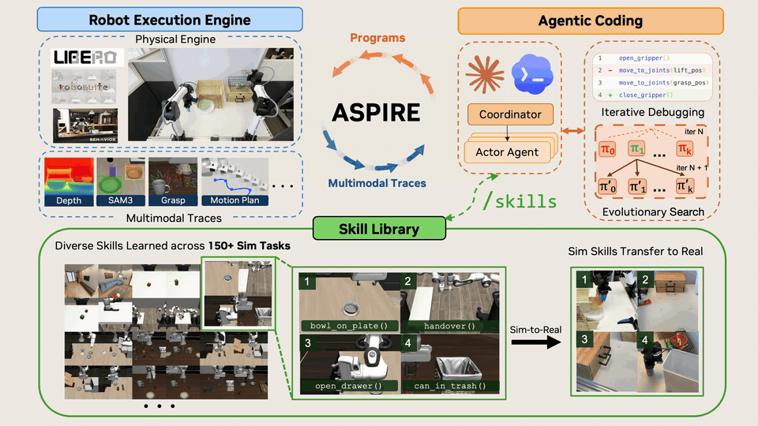

# ASPIRE: Agentic Skills Discovery for Robotics

[Project Page](https://research.nvidia.com/labs/gear/aspire/) &ensp;

**Runyu Lu<sup>1,2,&#42;,&dagger;</sup>, Yubo Wu<sup>1,3,&#42;</sup>, Ethan Kou<sup>1,4,&#42;</sup>,
Letian Fu<sup>1,4</sup>, Wenli Xiao<sup>1,5</sup>, Ajay Mandlekar<sup>1</sup>, Yinzhen Xu<sup>1</sup>,
Guanya Shi<sup>5</sup>, Ken Goldberg<sup>4</sup>, Ang Chen<sup>2</sup>, Mosharaf Chowdhury<sup>2</sup>,
Yuke Zhu<sup>1,&dagger;</sup>, Linxi "Jim" Fan<sup>1,&dagger;</sup>, Guanzhi Wang<sup>1,&dagger;</sup>**

<sup>1</sup>NVIDIA &ensp; <sup>2</sup>University of Michigan &ensp; <sup>3</sup>University of Illinois Urbana-Champaign &ensp; <sup>4</sup>UC Berkeley &ensp; <sup>5</sup>Carnegie Mellon University

<sup>&#42;</sup>Equal contribution &ensp; <sup>&dagger;</sup>Project leads

---

## Abstract

Traditional robot programming is notoriously challenging: it requires orchestrating multimodal perception, managing complex physical contact dynamics, and handling diverse environment configurations and execution failures. We introduce **Aspire (Agentic Skill Programming through Iterative Robot Exploration)**, a continual learning system for robotics that autonomously writes and refines robot control programs in a code-as-policy paradigm while compounding experience into a reusable skill library. Aspire enables automated discovery of reusable skills that persist across multiple tasks, simulation and real-world settings, and different embodiments.

Rather than relying on fixed, human-engineered pipelines, Aspire operates in an open-ended learning loop consisting of three key components: (1) a closed-loop robot execution engine that exposes fine-grained multimodal traces, such as perception overlays, grasp candidates, motion trajectories, and collision feedback, enabling the agent to autonomously diagnose failures, synthesize repairs, and validate outcomes; (2) a continually expanding skill library that distills validated fixes into reusable, transferable robotic knowledge; and (3) an evolutionary search procedure that generates diverse task sequences and control programs, systematically debugging them to explore beyond single-trajectory refinement.

As Aspire encounters more tasks, its growing skill library enables increasingly rapid adaptation. Consequently, Aspire surpasses prior methods by up to **77%** on manipulation tasks under perturbation (LIBERO-Pro), **72%** on Robosuite's bimanual handover task, and up to **32%** on long-horizon household tasks (BEHAVIOR-1K). The accumulated skill library further enables strong zero-shot generalization: on representative unseen long-horizon tasks (LIBERO-Pro Long), Aspire achieves **31%** success, substantially outperforming the **4%** success rate of prior methods despite their heavy reliance on test-time reasoning and retries. Finally, skills discovered in simulation provide initial evidence of sim-to-real transfer, substantially reducing real-robot programming effort despite different embodiments and robot APIs.

## Repository Layout

| Area | Purpose |
| ---- | ------- |
| [`aspire/sim/`](aspire/sim/README.md) | Simulation workspace for LIBERO-PRO, Robosuite, and BEHAVIOR-1K setup, configs, scripts, tests, agent runbooks, and outputs. |
| [`aspire/sim/cap/`](aspire/sim/cap/) | Code-as-policy simulation package imported as `aspire.sim.cap.*`. |
| [`aspire/real/`](aspire/real/README.md) | Real-station deployment code, operator workflows, and YAM robot integrations. |

## Security and Safety

ASPIRE's code-as-policy executors run Python generated by language models with
full import access. Simulator trial isolation and watchdogs are reliability
mechanisms, **not a security sandbox**. Treat generated code as untrusted: run
experiments in an isolated environment without host secrets or sensitive
mounts, restrict network access, and keep provider credentials in the separate
loopback-only proxy. Review generated code before granting it access to real
hardware; follow the real-robot operator controls before enabling motion.
Report potential security vulnerabilities privately by following
[`SECURITY.md`](SECURITY.md); do not disclose them through a public GitHub
issue or pull request.

## Setup

Simulation setup lives in [`aspire/sim/README.md`](aspire/sim/README.md). Start there for venv creation, submodule initialization, suite-specific setup, smoke tests, and experiment runbooks:

```bash
cd aspire/sim
```

Real-robot deployment and operator instructions live in [`aspire/real/README.md`](aspire/real/README.md), with fresh-machine requirements and the workstation recovery checklist in [`aspire/real/SETUP.md`](aspire/real/SETUP.md). Treat that directory as the working root for YAM commands:

```bash
cd aspire/real
bash tools/yam_demo_preflight.sh
bash tmux/launch_yam_demo_services.sh --no-attach
```

The focused launcher starts only the arm, camera, SAM3, and BundleSDF services
used by the canonical saved demo. See the real-workspace README before enabling
physical motion.

## Agent Guides

- Simulation agents: [`aspire/sim/CLAUDE.md`](aspire/sim/CLAUDE.md) and [`aspire/sim/.claude/README.md`](aspire/sim/.claude/README.md)
- Real-robot agent contract: [`aspire/real/AGENTS.md`](aspire/real/AGENTS.md)
- Real-robot skills: [`aspire/real/.agents/skills/`](aspire/real/.agents/skills/)

The simulation and real-robot workspaces intentionally keep separate commands,
dependencies, runtime artifacts, and agent instructions. The
`yam-simulation-transfer` skill links strategy knowledge across them without
reusing simulator coordinates or APIs on the physical robot.

## Contribution Guidelines

Start with [CONTRIBUTING.md](CONTRIBUTING.md). Third-party contributions must
include a Developer Certificate of Origin sign-off.

## License

ASPIRE material owned by NVIDIA or contributed under the project license is
available under the [Apache License 2.0](LICENSE). This repository also
contains inherited code, modified third-party code, dependency patches, Git
submodules, models, datasets, robot descriptions, and assets that retain their
original terms. See [NOTICE](NOTICE),
[THIRD_PARTY_LICENSES.md](THIRD_PARTY_LICENSES.md),
[THIRD_PARTY_NOTICES.md](THIRD_PARTY_NOTICES.md), and [LICENSES/](LICENSES/)
before using or redistributing the full stack.

The root Apache-2.0 license does not override those component-specific terms.
